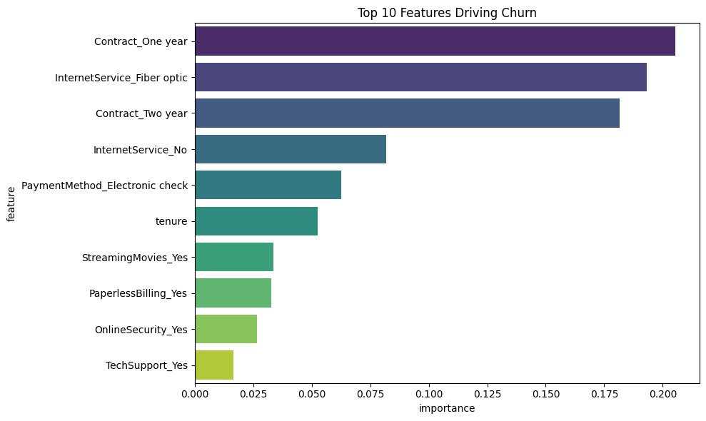
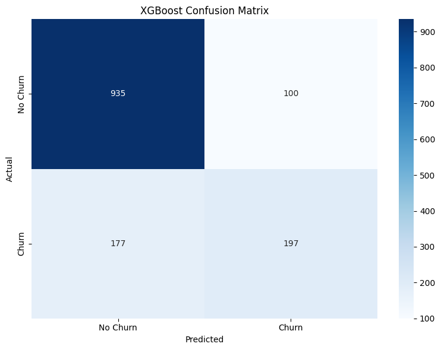
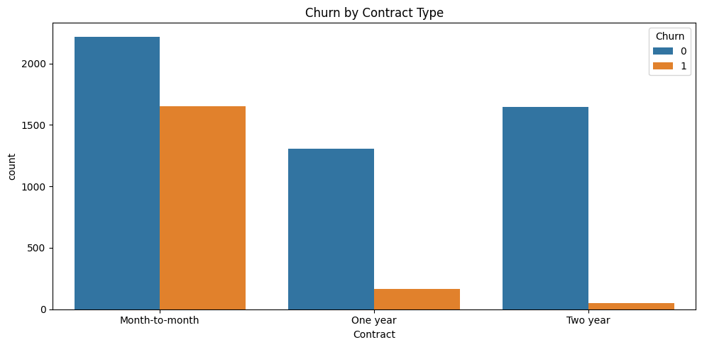

# Customer Churn Prediction (Telecom)

A machine learning project that predicts which telecom customers are likely to cancel their subscription, and identifies the key reasons behind churn.

## Why This Project

Retaining a customer is far cheaper than acquiring a new one. If a business can identify at-risk customers before they leave, it can target them with retention offers. The goal of this project is to build a model that flags those customers early.

## Dataset

- Source: IBM Telco Customer Churn (from Kaggle)
- Size: 7,043 customers
- Features: 20 columns including demographics, services used, contract type, and billing
- Target: Whether the customer churned (Yes/No)
- Churn rate in the data: 26.5%

## What I Did

1. Cleaned the data: converted TotalCharges to numeric, filled 11 missing values with the median, removed the customer ID column
2. Explored the data: looked at how churn varies by contract type, tenure, and monthly charges
3. Created new features: bucketed tenure into groups (New, Early, Established, Loyal) and one-hot encoded categorical columns
4. Trained three models: Logistic Regression, Random Forest, and XGBoost
5. Tuned XGBoost using GridSearchCV with 5-fold cross-validation across 12 parameter combinations
6. Evaluated using ROC-AUC, accuracy, precision, recall, and confusion matrix
7. Looked at feature importance to understand what drives churn

## Results

| Model | Accuracy | ROC-AUC |
|-------|----------|---------|
| Logistic Regression | 0.798 | 0.842 |
| Random Forest | 0.789 | 0.822 |
| XGBoost (tuned) | 0.803 | 0.846 |

Best XGBoost parameters: learning_rate=0.1, max_depth=3, n_estimators=100

## Charts

### Top 10 Features Driving Churn

### Confusion Matrix (XGBoost)

### Churn by Contract Type

## What I Learned From the Data

- Month-to-month customers cancel a lot more than customers on 1-year or 2-year contracts
- New customers (under 12 months) are the most likely to leave
- Customers with higher monthly charges churn more
- Fiber optic customers churn more than DSL customers
- Customers without add-ons like online security and tech support cancel more often

## Business Suggestions

1. Offer discounts to move month-to-month customers onto annual plans
2. Build a better onboarding experience for new customers in their first year
3. Look into why fiber optic customers are leaving (could be quality or pricing)
4. Bundle add-on services to give customers more reasons to stay

## Tools Used

- Python 3.11
- pandas, NumPy
- scikit-learn
- XGBoost
- matplotlib, seaborn

## How to Run

Install the dependencies and open the notebook:
